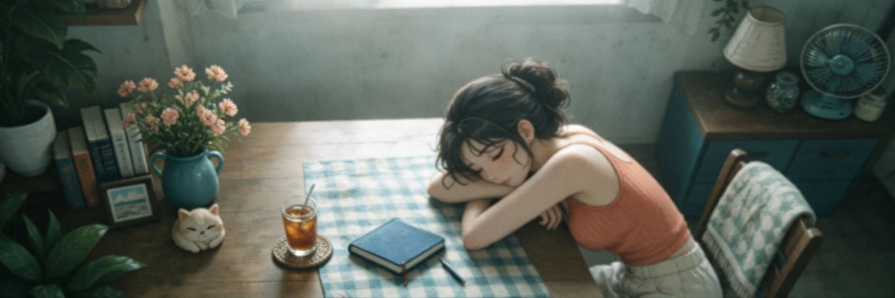

  

  <h1>Max</h1>

  
<em>Somewhere between nocode and a lazy summer afternoon.</em>

  

    <a href="https://github.com/C10udsea">@C10udsea</a>
  

<!--
Add a public contact email only when you have one that can receive messages.
GitHub noreply addresses protect commit privacy but cannot be used as inboxes.
-->
