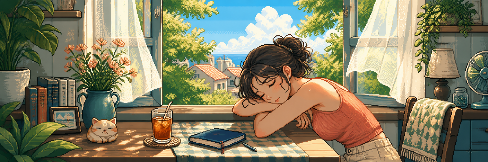

<!--
  C10udsea (Min) · GitHub Profile
  Replace placeholders: project-one / project-two
-->

  

  <!-- Typing animation: edit text via lines=, color via color=7C3AED -->
  

  

    <code>🏛️ Fudan University</code>
  

  

    <code>Communication Engineering</code> · <code>Now Base in Shanghai</code>
  

<table>
<tr>
<td valign="top" width="48%">

### 🌱 Currently

- 🎓 Studying at Fudan University, building a solid foundation in math & engineering
- 💻 Sharpening full-stack skills and shipping real projects
- 🤖 Exploring LLM applications (RAG / Agent / fine-tuning)
- 🤝 Open to: tech discussions · collaborations · internships

</td>
<td valign="top" width="52%">

### 🚀 Featured Projects

> Projects are on the way — stay tuned ✨ (replace the rows below once you have work to show)

| Project | Description |
| :--- | :--- |
| **[project-one](https://github.com/C10udsea/project-one)** | One line: what it does and what problem it solves. |
| **[project-two](https://github.com/C10udsea/project-two)** | One line: what it does and what problem it solves. |

</td>
</tr>
</table>
